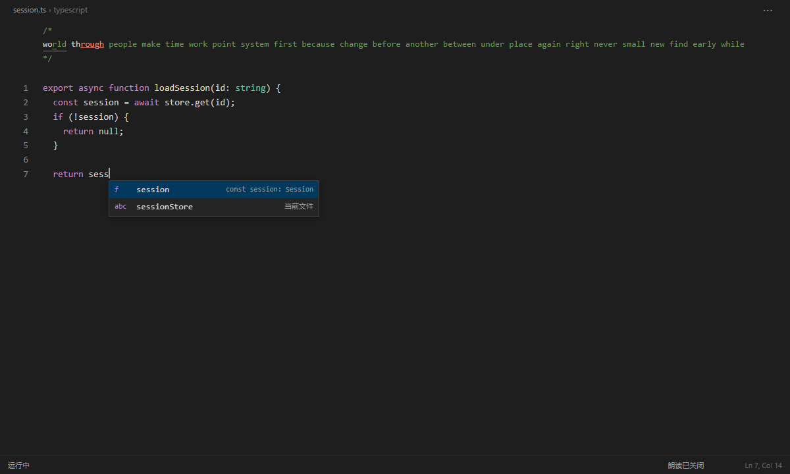

# TypeEcho 键语

在 VS Code 中练习英文打字，同时听单词和句子。TypeEcho 将真实按键连接到浏览器中的 Monkeytype，在独立练习页逐步显示当前代码文件，并提供逐词跟读、异步语音预生成和参考音频管理。

**正式版：1.0.0** · [下载安装包](https://github.com/Dulul818/TypeEcho/releases/latest) · [更新记录](CHANGELOG.md) · [开发与自测](docs/development.md) · [GPT-SoVITS 配置](docs/gpt-sovits.md)

## 功能

- 五种阅读位置：底部阅读条、原生状态栏、顶部代码注释、顶部阅读区、光标后注释。
- 阅读条支持左下、居中、靠右，标准或紧凑外观，字号、宽度、双行、光标显示、字数进度、悬停显示和失焦隐藏。
- 逐词、按句、混合朗读；按标点分段，保护单词内部撇号、连字符、小数和常见缩写。
- 异步准备整局已知句段及附近单词，显示准备进度、等待原因、播放队列及失败重试入口。
- 直接连接 GPT-SoVITS v2ProPlus；参考音频面板支持切换录音、试听原音、查看字幕及生成模型试听。
- 保留错字、漏字、多字反馈；文件接力、代码显示进度恢复和代码符号补全提示。
- 读取官网 WPM、准确率、经验回执和等级，自动保存本地 JSON / HTML 报告，可打印为 PDF。

TypeEcho 使用代码文件的内存快照，包括尚未保存的修改。它不编辑、执行或保存原代码；实际测试、登录和成绩提交由 Monkeytype 官网完成。



## 安装

日常使用需要 **VS Code 1.100+**、**Google Chrome** 和英文输入法。Windows 是当前实机验证平台；其他桌面系统的兼容边界见下文。

1. 从 [Releases](https://github.com/Dulul818/TypeEcho/releases/latest) 下载 `typeecho-1.0.0.vsix`。
2. 在 VS Code 扩展面板右上角 `…` 选择“从 VSIX 安装”。
3. 安装或升级后执行 **Developer: Reload Window**。

也可以通过终端安装：

```sh
code --install-extension typeecho-1.0.0.vsix --force
```

从旧版 Code Type Bridge 升级时直接覆盖安装即可。为保留已有登录目录、进度和偏好，内部扩展 ID 仍为 `local-prototype.code-type-bridge`，命令 ID 和设置项仍使用 `codeType.*`；界面名称统一为 **TypeEcho 键语**。无需同时安装两个插件。

## 开始练习

1. 命令面板运行 **TypeEcho: 打开官网 / 登录**。在普通 Chrome 窗口中手动登录 Monkeytype。
2. 登录完成后关闭这个窗口，使独立练习配置目录保存登录状态。日常使用的其他 Chrome 窗口无需关闭。
3. 在 VS Code 打开一个有内容的代码文件，运行 **TypeEcho: 用当前文件开始练习**。
4. 首次使用时在官网关闭弹窗、选择英文测试并点击单词区域。回到练习页，点击代码区或阅读条开始输入。
5. 使用 Space 换词、Backspace 改错；Esc 退出并回到原文件。

**官网窗口可以被 VS Code 遮住，但不要最小化或切换其标签。** 切换窗口、输入焦点或使用快捷键会暂停按键转发；点击练习页可继续。官网计时不会随之暂停。

测试结束后，底部显示成绩摘要，点击可展开报告。按 Enter 或通过 `⋯ → Next test / Repeat test` 开始下一场。`⋯ → 测试设置` 支持 time、words、quote、英文词库、标点和数字；应用设置会开始新测试。

## 阅读与代码显示

显示选项位于 `⋯ → 测试设置`，会自动保存。

| 选项 | 行为 |
| --- | --- |
| 底部阅读条 | 默认紧凑单行；宽度 240–960px，字号 12–24，窄窗口自动收窄 |
| 显示光标 | 控制底部阅读条输入光标，隐藏后仍跟随输入滚动 |
| 显示字数进度 | 控制当前词已输入 / 总字符数，适用于阅读条及原生状态栏 |
| 显示器居中 | 鼠标经过练习页后校准，位置限制在 Webview 内 |
| 悬停显示 / 失焦隐藏 | 控制自绘阅读区可见性，不暂停官网计时 |
| 光标后注释 | 每组 2 / 4 / 8 / 12 / 16 词，空间不足时截断，可悬停查看 |
| 原生状态栏 | 每组 4 / 8 / 12 / 16 词，受 VS Code 限制，仅提供整组错误色 |

输入只改变单词颜色和光标，错字不会挤动目标文字。换词后错误反馈保留，退格改正后更新，新一局清除。底部阅读条按完整单词自然换行，双行模式最多显示两行。

代码显示进度按文件路径和内容保存，内容变化后使用新的进度。换行及后续缩进一起显示，行内空格逐字显示。`TypeEcho: 从头显示当前文件` 可重置显示位置。每个文件最多 100,000 字符。

`⋯ → 选择接力文件…` 可加入多个文件，当前文件显示完后继续下一份，各文件独立保存进度。清空接力队列不会清除当前显示进度。补全列表默认使用当前文件符号，仅作提示；需要语言服务补全可开启 `codeType.nativeCompletions`。

## 朗读

入口为 `⋯ → 语音设置`。可开启或关闭朗读、选择模式、调整音量、重听当前句和打开参考音频面板。

| 模式 | 行为 |
| --- | --- |
| 逐词 | 按顺序完整读完已排入的词，当前词正确打完即可提前排入下一词 |
| 按句 | 进入句段时朗读，句内换词不打断，不自动重复已读句段 |
| 混合 | 先读句段，读完后跟随输入逐词朗读 |
| 智能补词 | 仅混合模式：整段读完后，只补读错误或停顿的词 |

官网 **words 模式固定逐词朗读**，切回其他模式会恢复保存的朗读选择。自动整段朗读至少需要两个有效词，例如 `a man; girl, and a ship` 中的 `girl,` 不额外读一遍整段。手动重听不受此限制。

逐词去掉外围标点，`today.` 读作 `today`；`don't`、`you're`、`well-known`、`3.14` 保留内部符号。句段保留标点。没有标点的长段通常按约 25 词拆分，单次文本最多 1200 个 ASCII 字符。

**预生成与等待：** 当前词和后续最多 32 词提前准备；按句及混合模式还会后台生成本局已知多词句段。附近内容优先，正在等待播放的请求优先于尚未开始的后台任务。GPT-SoVITS 同一时间仅运行一个合成请求，输入无需等待模型。

普通音频缓存最多 128 段、32MiB；本局整句音频另行保留到本局结束，内存随音频总长增长。官网尚未生成的未来单词无法预生成。底部显示准备数量、等待模型、加载音频、正在朗读和排队数量，失败时可重试。

GPT-SoVITS 单词的额外尾部静音为 30ms，多词句段维持 300ms；从整句转到下一播放任务另保留 160ms 间隔。播放队列不跳词、不截断发音，因此持续打字快于朗读时仍可能积压。暂停、失焦、关闭朗读、切换模式、重听或结束测试会清空播放队列，迟到音频不会播放。

音量 0–300% 在播放端调整，系统语音上限为 100%。高音量可能失真。孤立词缺少上下文，模型仍可能出现多音词歧义或短词发音不稳定。

## 语音接口

运行 **TypeEcho: 语音设置**。未配置 `codeType.ttsEndpoint` 时使用系统语音：Windows 使用系统语音引擎，其他系统尝试 Webview 语音。

### GPT-SoVITS

详见 [部署与参考音频管理](docs/gpt-sovits.md)。模型服务需要单独安装、启动，VSIX 不包含模型权重或训练数据。

```json
{
  "codeType.ttsProvider": "gpt-sovits",
  "codeType.ttsEndpoint": "http://127.0.0.1:9880/tts",
  "codeType.ttsReference": {
    "audio": "D:/Models/reference.wav",
    "text": "The exact transcript of your reference recording.",
    "language": "en"
  },
  "codeType.ttsRate": 1
}
```

运行 **TypeEcho: 参考音频与试听** 可导入录音、填写字幕、试听原录音、切换参考及生成模型试听。录音与字幕一起保存；切换后旧音色的缓存和队列会清空。

### 通用接口

设置 `codeType.ttsProvider` 为 `custom`，接口接收以下 POST JSON，直接返回 `audio/wav`、`audio/mpeg` 等音频字节：

```json
{"text":"Hello world.","language":"en-US","voice":"your-voice","rate":1}
```

响应不能是 JSON 或音频 URL。单次请求超时 30 秒，音频上限 12MiB。需要鉴权或不同协议的服务通过本地适配服务接入。`ttsVoice` 仅用于系统或通用接口，GPT-SoVITS 的音色由服务端模型和参考录音决定。

## 数据与边界

- 原代码仅在本地显示。浏览器收到练习按键，TTS 服务收到官网英文文本、语音参数及配置的参考路径和字幕。
- 登录状态保存在扩展数据目录的独立 `browser-profile` 中。扩展不读取密码、Cookie 或令牌，也不自行提交或重试成绩。
- 官网提交结果后，扩展读取回执；未确认时显示“XP 待确认”，等级未读取到时显示 `Lv --`，不推算。
- 本地报告保存在扩展数据目录的 `results`，不保存官网截图。删除项目测试日志不会删除这些报告或登录状态。
- 输入仅支持英文 ASCII、数字、常用标点、Shift 和 Backspace，不支持粘贴、中文组合输入和自动输入。积压按键超过 250ms 会暂停。
- 练习页是 Webview，不是完整代码编辑器。官网 DOM 改动可能需要适配；浏览器自动检测只查找 Chrome，其他兼容浏览器需要显式填写 `codeType.browserPath`。
- Windows + Chrome 已进行本地自动及实机检查。macOS / Linux、实际多显示器校准、不同账号登录及长期稳定性不据此保证。

## 开发

使用 Node.js 24 LTS 和 pnpm 11.19.0：

```sh
git clone https://github.com/Dulul818/TypeEcho.git
cd TypeEcho
pnpm install --frozen-lockfile
pnpm test
pnpm test:browser
pnpm test:ui
pnpm package
```

安装包输出到 `releases/typeecho-1.0.0.vsix`。浏览器检查需要 Chrome，Playwright 已列入开发依赖。目录、自测范围和发布步骤见 [开发说明](docs/development.md)。

## 许可

项目采用 [MIT](LICENSE)，打包依赖许可见 [THIRD_PARTY_NOTICES.txt](THIRD_PARTY_NOTICES.txt)。模型、参考录音和训练数据使用各自许可，不随源码或 VSIX 分发。

TypeEcho 是独立项目，与 Monkeytype 官方无隶属关系；测试与成绩仍适用官网规则。
